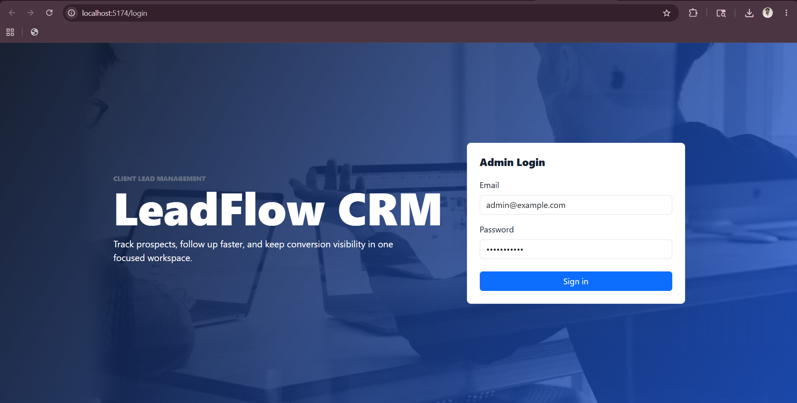
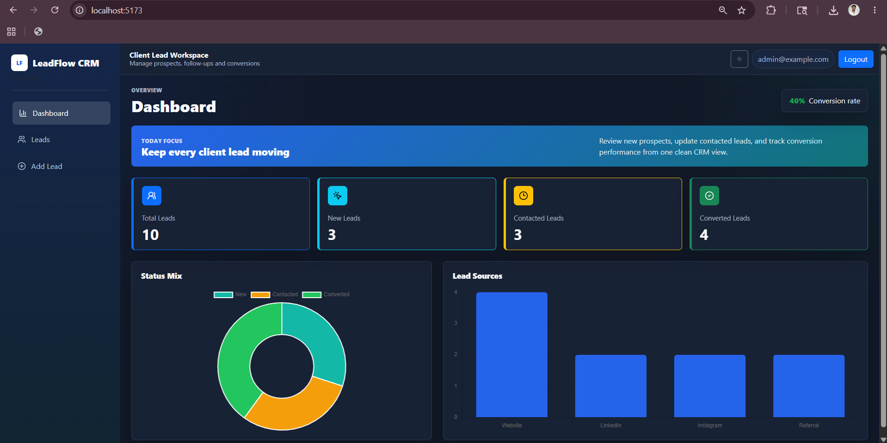
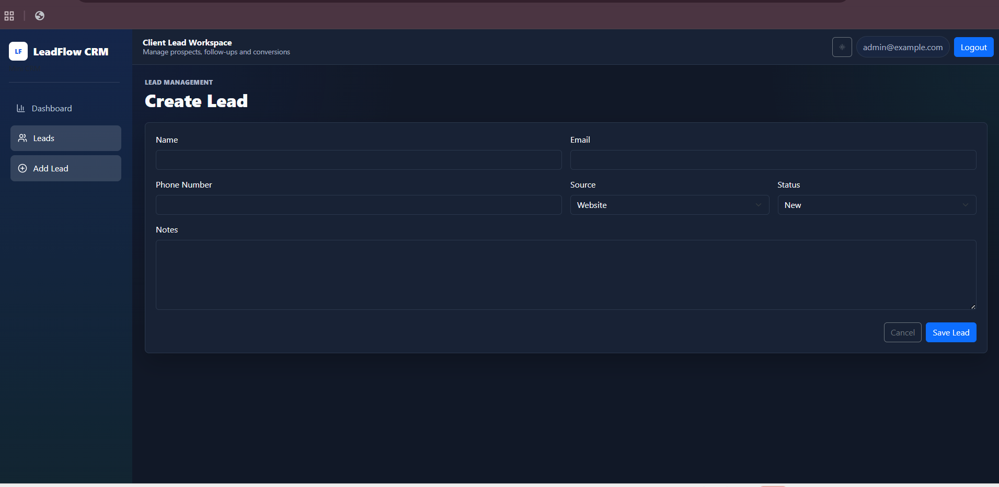
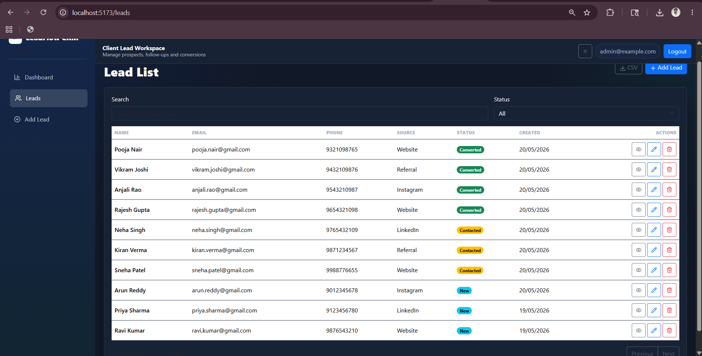

# Client Lead Management System (Mini CRM)


## 📌 Project Overview

The **Client Lead Management System (Mini CRM)** is a full-stack web application designed to help businesses efficiently manage and track customer leads throughout the sales process.

The system allows administrators to securely manage incoming leads, update their progress, maintain follow-up records, and monitor conversion performance through an interactive dashboard.

This project was developed as part of the **Future Interns - Full Stack Web Development Internship** for **Task 2 - Client Lead Management System (Mini CRM)**.

## 🧩 Problem Statement

Businesses often receive customer inquiries through websites, social media, advertisements, and referrals. Managing these leads manually using spreadsheets can be inefficient, difficult to maintain, and prone to errors.

This CRM application provides a centralized platform where administrators can:

- Store customer lead information
- Track lead status
- Manage follow-up notes
- Monitor conversions
- Analyze lead performance
- Improve the overall lead conversion workflow

## ✨ Features

| Category | Features |
| --- | --- |
| Authentication & Security | Secure admin login, JWT authentication, bcrypt password hashing, protected routes |
| Lead Management | Add, view, edit, delete, search, and filter leads |
| Lead Tracking | Track leads through New, Contacted, and Converted stages |
| Dashboard Analytics | View total leads, status counts, conversion rate, and visual analytics |
| Productivity | CSV export, follow-up notes, responsive UI, dark mode |

### 🔐 Authentication & Security

- Secure Admin Login
- JWT-based Authentication
- Password hashing using bcrypt
- Protected Routes
- Session Management

### 👥 Lead Management

- Add New Leads
- View Lead Details
- Edit Existing Leads
- Delete Leads
- Search Leads
- Filter Leads by Status
- Export Leads as CSV

### 🔄 Lead Tracking Workflow

```text
New -> Contacted -> Converted
```

| Status | Description |
| --- | --- |
| New | Customer has shown interest in the business |
| Contacted | Admin has communicated with the customer |
| Converted | Customer has successfully become a client |

### 📊 Dashboard Analytics

- Total Leads
- New Leads Count
- Contacted Leads Count
- Converted Leads Count
- Conversion Rate
- Status Distribution Charts
- Lead Source Analytics

### 📝 Lead Information

Each lead contains:

- Name
- Email Address
- Phone Number
- Lead Source
- Lead Status
- Follow-up Notes
- Created Date
- Updated Date

## 🛠️ Technology Stack

| Layer | Technologies Used |
| --- | --- |
| Frontend | React.js, Vite, JavaScript, CSS |
| Backend | Node.js, Express.js |
| Database | MongoDB, Mongoose |
| Authentication | JWT, bcrypt |
| API Communication | Axios |
| Routing | React Router |
| Charts & UI | Chart.js, Bootstrap, Lucide React |
| Version Control | Git, GitHub |

## 🚀 Skills Demonstrated

- Full Stack Web Development
- REST API Development
- CRUD Operations
- Authentication & Authorization
- MongoDB Database Management
- State Management
- Responsive Web Design
- Business Workflow Automation
- Dashboard and Analytics Implementation
- Git & GitHub Version Control

## 🌍 Real-World Use Case

This CRM system can be used by:

- Web Development Agencies
- Digital Marketing Companies
- Freelancers
- Startups
- Educational Institutions
- Real Estate Businesses

It helps teams manage customer inquiries, track communication, organize follow-ups, and improve lead conversion efficiency.

## 🎯 Project Outcome

This project demonstrates how a modern CRM system helps businesses organize client information, streamline communication, track customer interactions, and convert potential leads into paying customers through a structured workflow.

## ⚙️ Installation

### 1. Clone Repository

```bash
git clone https://github.com/allambharathsai/FUTURE_FS_02.git
cd FUTURE_FS_02
```

### 2. Install Backend Dependencies

```bash
cd backend
npm install
```

### 3. Configure Backend Environment

Create a `.env` file inside the `backend` folder using `.env.example` as reference.

```bash
cp .env.example .env
```

For Windows PowerShell:

```powershell
Copy-Item .env.example .env
```

Example backend environment:

```env
PORT=5000
MONGO_URI=your_mongodb_connection_string
JWT_SECRET=your_jwt_secret
CLIENT_URL=http://localhost:5173
```

### 4. Start Backend Server

```bash
npm run dev
```

Backend server:

```text
http://localhost:5000
```

### 5. Install Frontend Dependencies

Open a new terminal:

```bash
cd frontend
npm install
```

### 6. Configure Frontend Environment

Create a `.env` file inside the `frontend` folder using `.env.example` as reference.

```bash
cp .env.example .env
```

For Windows PowerShell:

```powershell
Copy-Item .env.example .env
```

Example frontend environment:

```env
VITE_API_URL=http://localhost:5000/api
```

### 7. Start Frontend Application

```bash
npm run dev
```

Frontend application:

```text
http://localhost:5173
```

## 🔑 Default Admin Login

```text
Email: admin@example.com
Password: Admin@12345
```

## 📁 Project Structure

```text
FUTURE_FS_02/
|-- backend/
|   |-- config/
|   |   |-- db.js
|   |   |-- store.js
|   |-- controllers/
|   |   |-- authController.js
|   |   |-- leadController.js
|   |-- middleware/
|   |   |-- authMiddleware.js
|   |   |-- errorMiddleware.js
|   |-- models/
|   |   |-- Lead.js
|   |   |-- User.js
|   |-- routes/
|   |   |-- authRoutes.js
|   |   |-- leadRoutes.js
|   |-- data/
|   |-- package.json
|   |-- server.js
|
|-- frontend/
|   |-- src/
|   |   |-- components/
|   |   |   |-- Layout.js
|   |   |   |-- Loading.js
|   |   |   |-- ProtectedRoute.js
|   |   |   |-- StatusBadge.js
|   |   |-- pages/
|   |   |   |-- Dashboard.js
|   |   |   |-- LeadDetails.js
|   |   |   |-- LeadForm.js
|   |   |   |-- Leads.js
|   |   |   |-- Login.js
|   |   |-- services/
|   |   |   |-- api.js
|   |   |   |-- AuthContext.js
|   |   |   |-- leadService.js
|   |   |-- App.js
|   |   |-- index.js
|   |   |-- styles.css
|   |-- index.html
|   |-- package.json
|   |-- vite.config.js
|
|-- screenshots/
|   |-- login.png
|   |-- dashboard.png
|   |-- leads.png
|   |-- details.png
|
|-- .gitignore
|-- README.md
```

## 📸 Project Screenshots

### 🔐 Admin Login Page



Secure admin authentication page using JWT-based login.

### 📊 Dashboard



Displays total leads, new leads, contacted leads, converted leads, conversion rate, and analytics charts.

### 👥 Lead Management



Manage all leads with search, filter, edit, delete, and status tracking functionality.

### 📝 Lead Details



View complete lead information, notes, follow-ups, and lead status updates.

## 📡 API Endpoints

### Authentication

| Method | Endpoint | Description |
| --- | --- | --- |
| POST | `/api/auth/login` | Admin login |

### Leads

| Method | Endpoint | Description |
| --- | --- | --- |
| GET | `/api/leads` | Get all leads |
| GET | `/api/leads/:id` | Get single lead details |
| POST | `/api/leads` | Create a new lead |
| PUT | `/api/leads/:id` | Update lead information |
| DELETE | `/api/leads/:id` | Delete a lead |
| PUT | `/api/leads/status/:id` | Update lead status |
| GET | `/api/leads/stats/summary` | Get lead analytics |

Protected routes require:

```http
Authorization: Bearer <jwt_token>
```

## 💡 My Learning Experience

Building this Client Lead Management CRM was a valuable learning experience during my Full Stack Web Development Internship at Future Interns.

Through this project, I gained hands-on experience in:

- Developing a complete full-stack application using React, Node.js, Express.js, and MongoDB.
- Designing and implementing RESTful APIs.
- Understanding real-world business workflows and CRM systems.
- Managing lead tracking processes from New -> Contacted -> Converted.
- Implementing JWT Authentication and secure route protection.
- Working with CRUD operations and database integration.
- Building responsive dashboards and analytics components.
- Organizing project structure using industry-standard practices.

One of the most important lessons I learned was how software helps businesses manage customer relationships efficiently and improve lead conversion processes.

This project strengthened my understanding of frontend development, backend APIs, authentication, database management, problem solving, and real-world software development.

## 🚀 Future Enhancements

- Email Notifications
- Role-Based Access Control
- Advanced Analytics Dashboard
- Lead Assignment System
- CRM Activity Logs
- Cloud Deployment
- Real-Time Notifications

## 🏢 Internship Information

| Field | Details |
| --- | --- |
| Organization | Future Interns |
| Track | Full Stack Web Development |
| Task Number | Task 2 |
| Project | Client Lead Management System (Mini CRM) |
| Repository | FUTURE_FS_02 |

## 👨‍💻 Developer

**ALLAM BHARATH SAI**

B.Tech Computer Science and Engineering

Passionate about Full Stack Development, Web Technologies, Software Engineering, Problem Solving, and building real-world applications.

### Technical Skills

- React.js
- JavaScript
- Node.js
- Express.js
- MongoDB
- REST APIs
- JWT Authentication
- Git & GitHub

### Professional Summary

I developed this **Client Lead Management System (Mini CRM)** as part of the **Future Interns Full Stack Web Development Internship**.

This project provided practical experience in building a complete full-stack application using React, Node.js, Express.js, and MongoDB. It helped me understand real-world CRM workflows, lead management processes, authentication systems, database operations, and API development.

Through this project, I strengthened my skills in:

- Full Stack Web Development
- CRUD Operations
- RESTful API Development
- JWT Authentication
- MongoDB Database Management
- Responsive UI Development
- Business Workflow Automation
- Git & GitHub Version Control

One of the most valuable lessons from this project was understanding how businesses track and convert potential customers using CRM systems and how technology can streamline these processes efficiently.

### Connect With Me

[](https://github.com/allambharathsai)
[](https://www.linkedin.com/in/allambharathsai/)

## 📄 License

This project is created for internship and educational purposes.
